
<h1 align="center">预报名管理系统</h1>

## 简介
预报名管理系统：角色分为管理员、用户；论坛管理、活动报名管理、公告资料管理、用户信息管理、评论互动功能。支持快速检索和分页浏览，提高信息获取效率和用户管理便捷性。    --计算机毕业设计源码；毕设源码；java毕业设计源码

## 联系方式

<h3 align="center">获取完整代码与数据库文件 + 微信：deepguan QQ: 86050149 QQ群: 783742310</h3>

<h3 align="center">可帮忙远程部署 包运行成功！提供远程部署、修改代码、设计文档指导、代码讲解等服务！</h3>

## 功能介绍（完整见运行截图）
管理员： 系统提供基础数据管理、论坛管理、活动报名管理、公告资料管理和用户管理等功能，管理员可以选择查看论坛的帖子回复详情，并进行管理操作，如删除帖子和管理回复。此外，管理员可以查询和审核活动报名信息，通过筛选报名编号或用户名查看相关记录，并执行审核操作。用户管理功能允许管理员查看和编辑用户列表，提供详情、修改、删除及密码重置功能，以便有效管理用户信息。

用户： 用户可以通过系统登录并访问预报名管理系统的多种功能模块，包括论坛、公告资讯、活动报名和公共资料等。用户可以发布和评论论坛帖子，查看公告资讯，使用筛选和搜索功能以快速查找信息。活动报名模块提供用户查询和管理特定活动信息的功能，并对活动内容进行点赞和评论。个人中心模块则支持用户进行个人信息查看和修改，收藏活动与管理报名信息，用户还可以查看有关活动和资料的详细内容。

## 运行截图
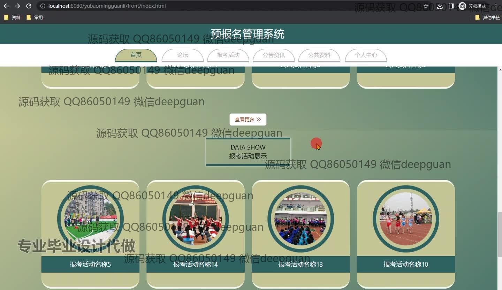
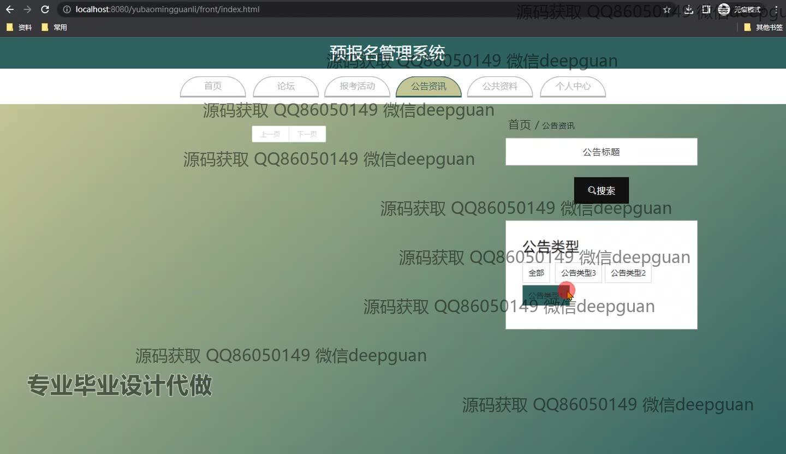
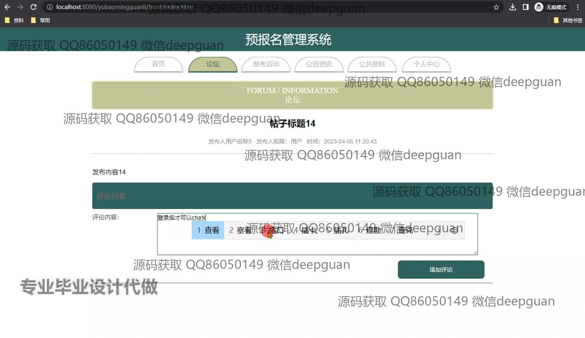
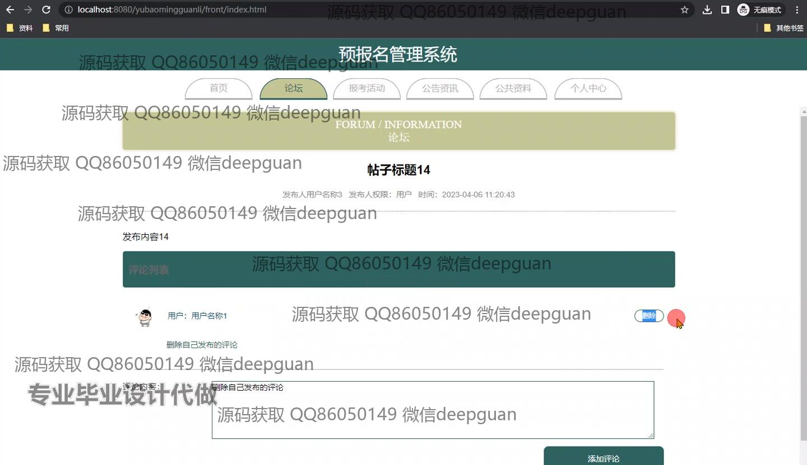
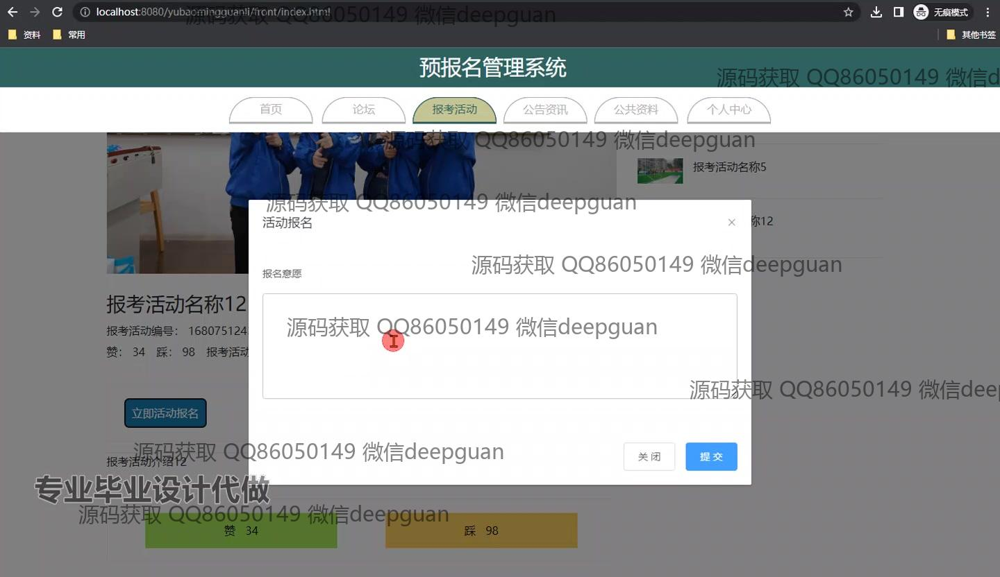
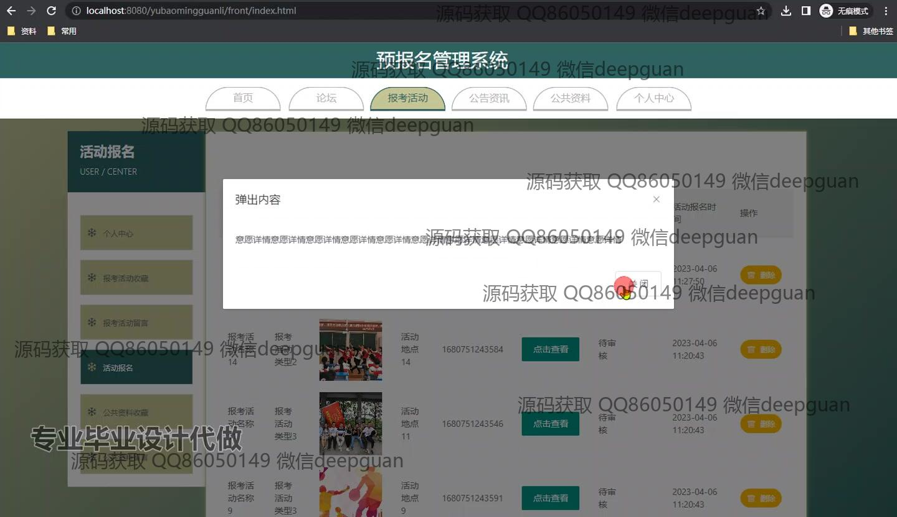
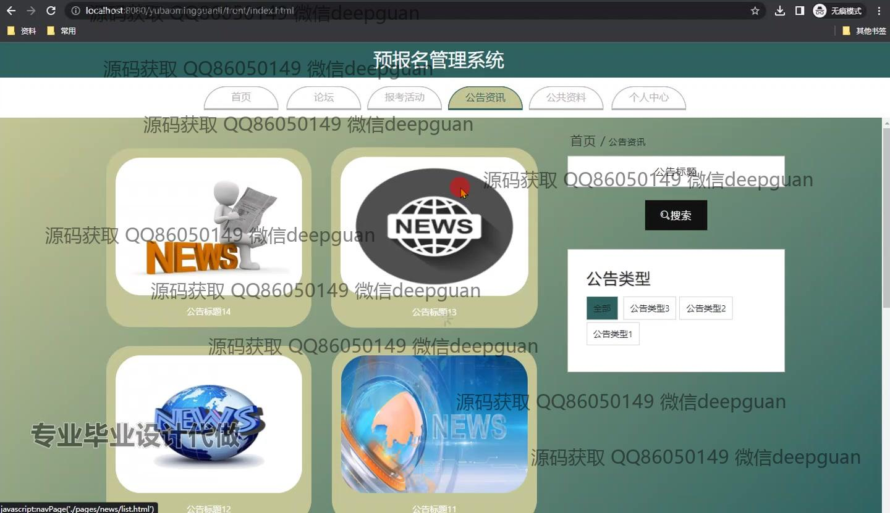
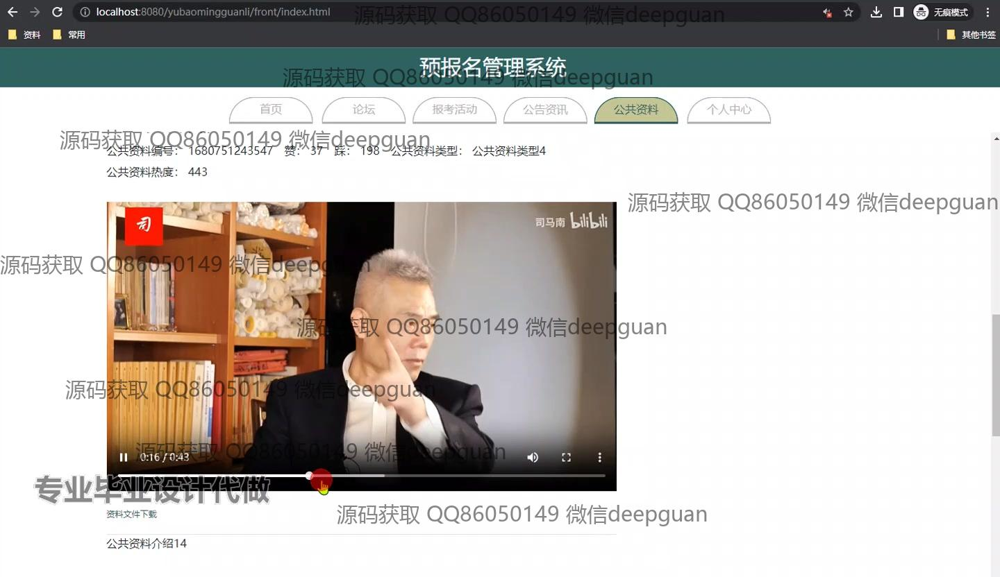
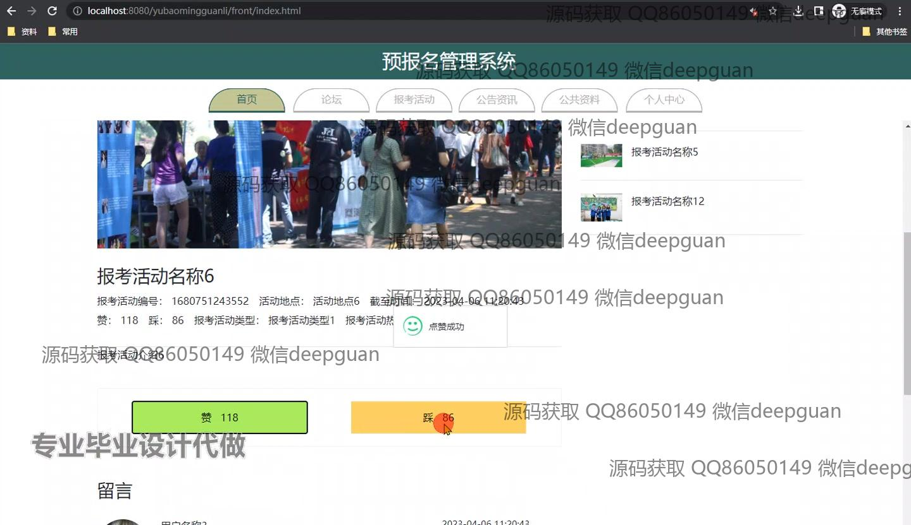
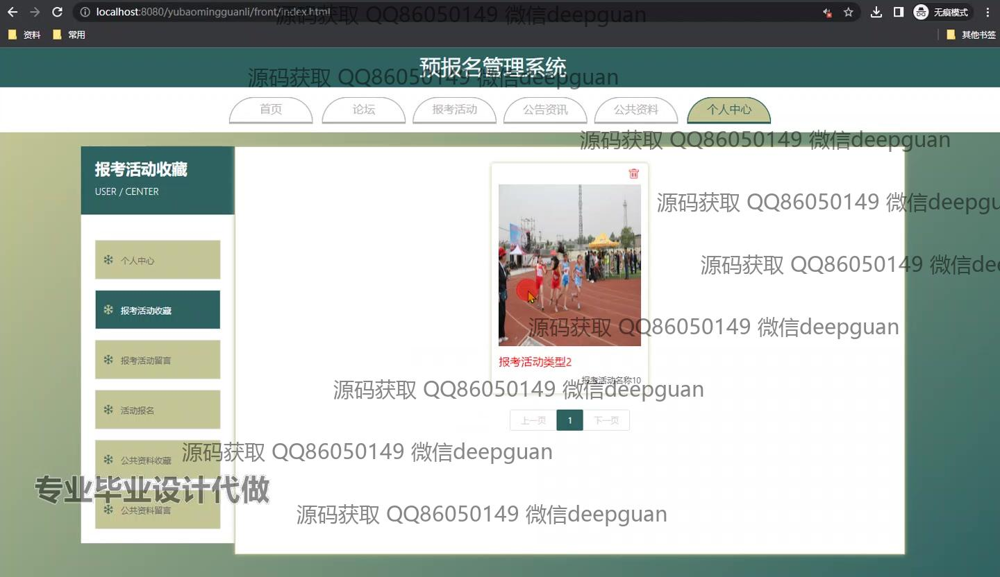
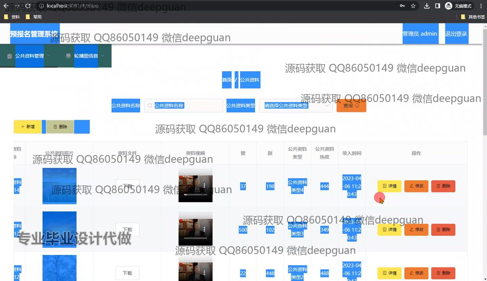
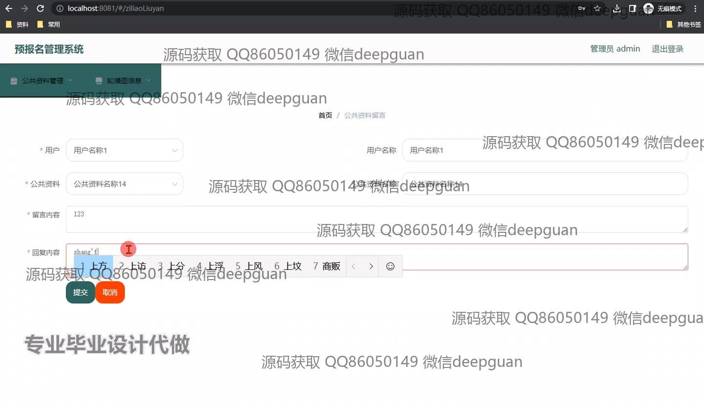
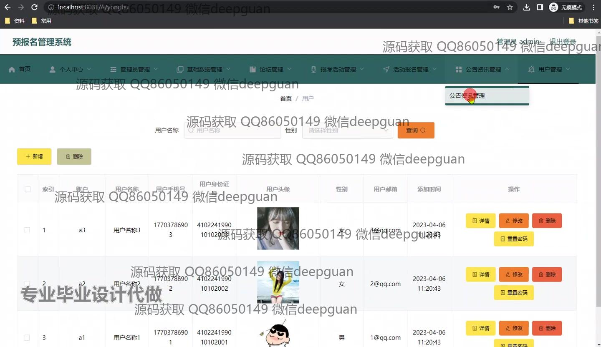
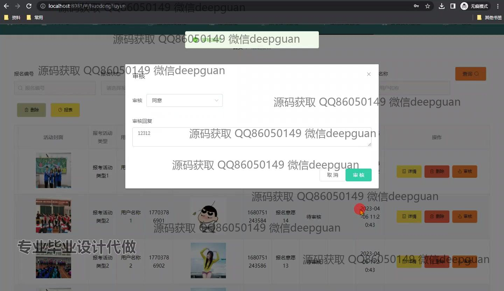
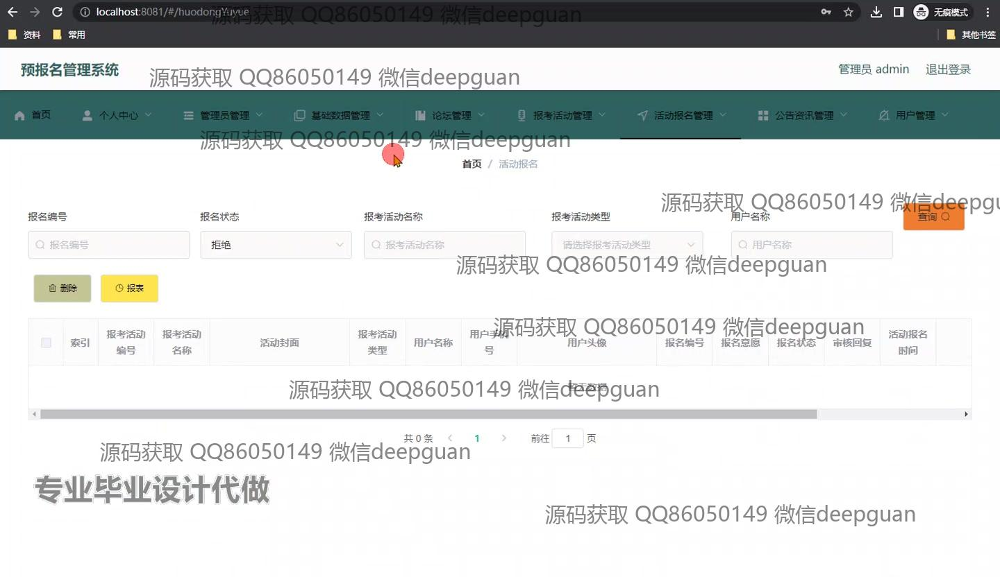
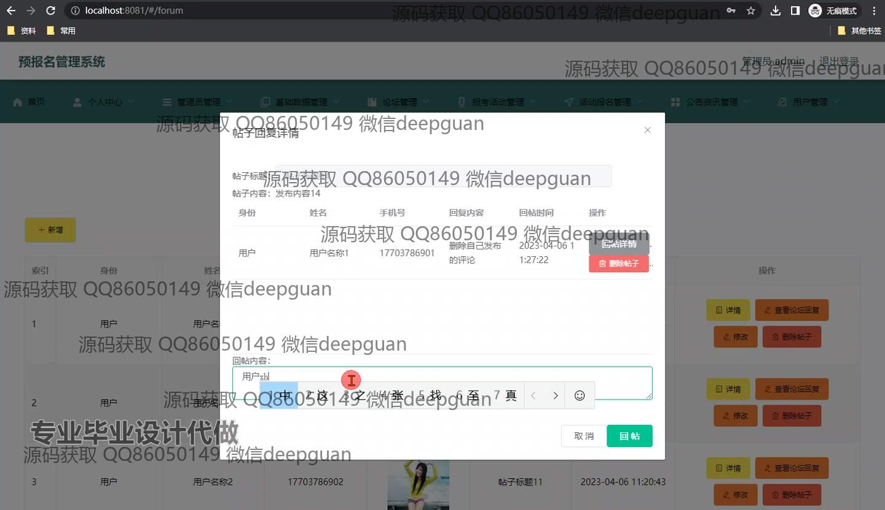
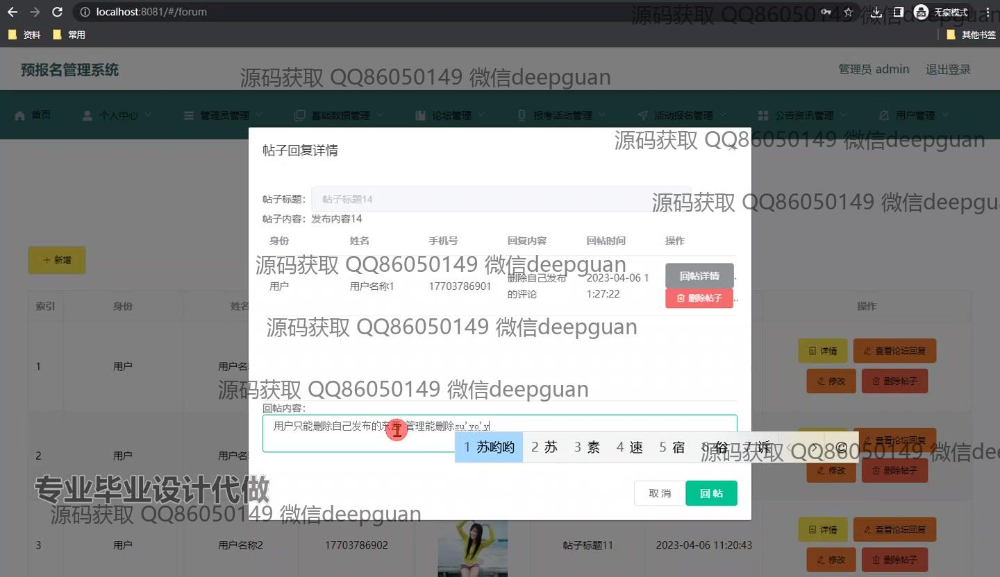
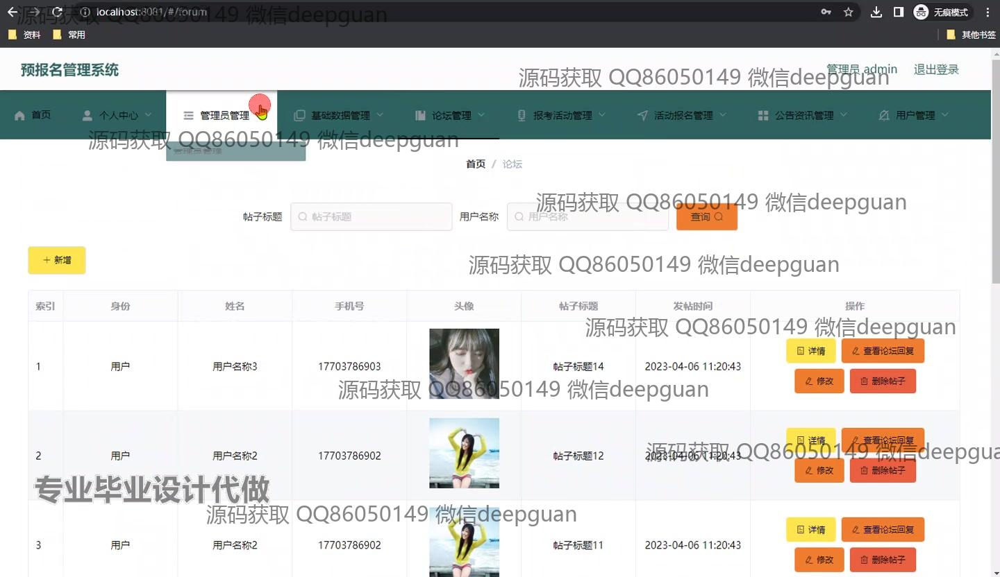

本代码来源于网络,仅供学习参考使用!

